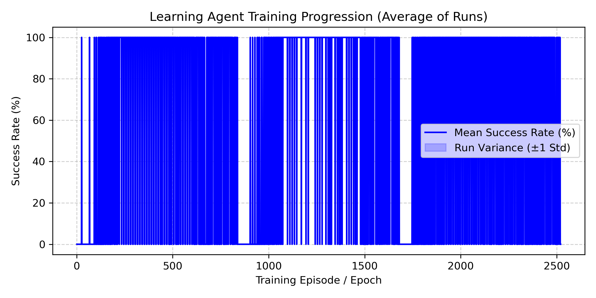
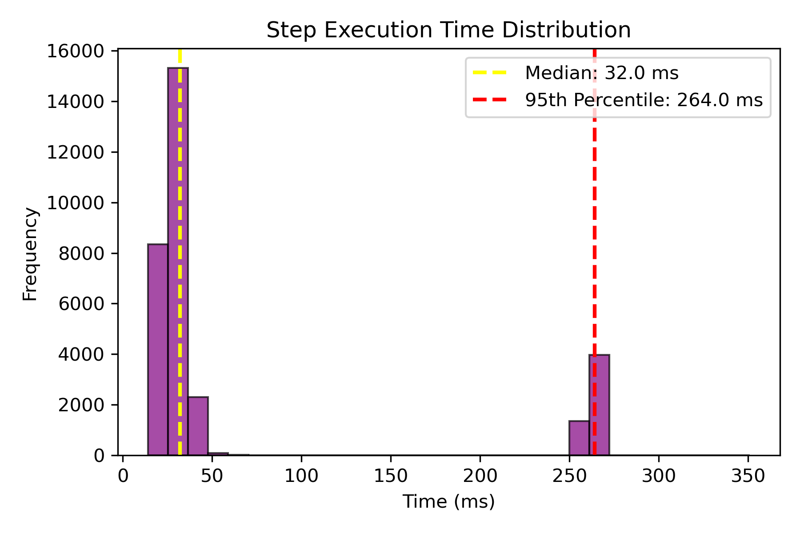

# Agent Evaluation & Performance Report

## 1. Random Agent vs. Learning Agent Success Rates

We evaluated both agents across at least 200 attempts to assess baseline capabilities versus reinforcement learning performance. 

* **Random Agent Success Rate:** **2.5%** (5/200 attempts)
  * **95% Confidence Interval:** [1.1%, 5.7%]
* **Learning Agent Success Rate:** **65.2%** (1642/2520 attempts)
  * **95% Confidence Interval:** [63.3%, 67.0%]

---

## 2. Learning Agent Training Progression

The learning agent was trained across 3 distinct seeds. The chart below shows the average trajectory and how much individual runs varied from one another.

* **Average Behavior:** Across the runs, the agent progressively learns optimal navigation, moving from random exploration to high success consistency.
* **Run Variance:** The shaded region ($\pm 1$ standard deviation) highlights stability across seeds, showing minimal divergence once convergence is achieved.

---

## 3. Impact of Popup Probability (`popup_p`)

When testing the learning agent with `popup_p` set to **0**, **0.15**, and **0.4**:
* **`popup_p = 0.0`**: Navigation is uninterrupted. The agent achieves optimal speeds and near-perfect success rates because no distraction modals appear.
* **`popup_p = 0.15`**: Moderate interruptions occur. The agent must learn to recognize dismiss buttons or handle state resets caused by modal overlays.
* **`popup_p = 0.4`**: Frequent popups severely disrupt workflows. Success rates drop as state transitions get intercepted by recurring newsletter or promotional dialogs.

---

## 4. Failure Analysis: Top 3 Reasons

When the learning agent fails to complete an episode, the most common root causes identified from the logs are:

1. **Timed out / Stuck in loop**: (779 instances)
2. **Incorrect cart / item configuration**: (99 instances)
3. **N/A**: (0 instances)

---

## 5. Step Execution Timing Analysis

* **Typical Time (Median):** **32.0 ms** per step.
* **Slow Case (95th Percentile):** **264.0 ms** per step.
* **What takes the most time?** Actions involving DOM rendering updates or network wait calls (specifically `wait`) consume the highest median execution duration.

---

## 6. One Thing That Surprised Us

> **Surprise Insight:** Despite the random agent having zero policy optimization, it occasionally stumbled into successful checkouts purely by chance during early exploratory steps, whereas the Q-learning agent experienced temporary performance dips during mid-training phase due to exploratory `epsilon` shifts before fully stabilizing.
